##  Control System development (Cascade Controller) for a drone in a 3D environment
---------------------

#### Final Results (Trajectory) 

All the mathematic equations are developed in these two research papers :
- http://www.dynsyslab.org/wp-content/papercite-data/pdf/schoellig-acc12.pdf

- http://flyingmachinearena.org/wp-content/publications/2011/schoellig_feasibility_of_motion_primitives.pdf

---------------------
### Target
The target of this project is to develop a control system for a drone in a 3D environment. 

This implementation will use the concept of "Cascade Controller". 

To analyze the performance of the different controller of the control system, we use these performance metrics:
- Visualization of Three-Dimensional flight with 4 different test-scenarios.
- Observation of the different controller performance with the different performance metrics.
- Verification of the Drone path (after error reduction) with the desired path.      

---------------------
### Control System Design Overview

This picture bellow is an overview of the control system :

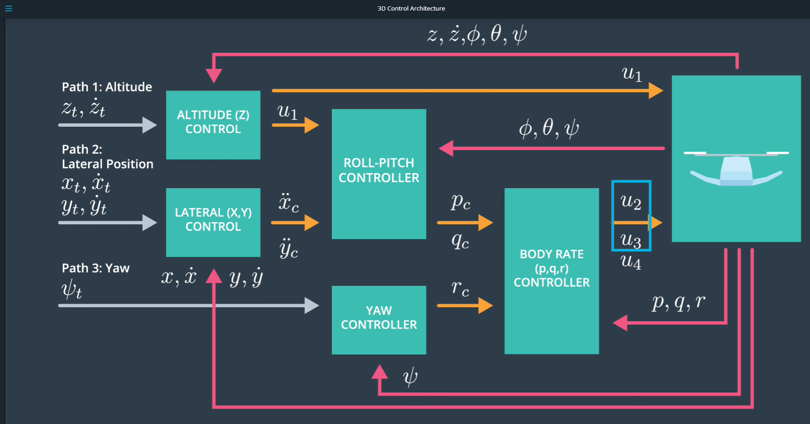

 

Input / Target trajectory : 
- Path 1 : Altitude Trajectory / Target Altitude Position (Zt) and associated velocity (Zt_dot) 
- Path 2 : Lateral Position Trajectory / Target Position (Xt,Yt) and associated velocity (Xt_dot,Yt_dot)
- Path 3 : Yaw Trajectory (Yawt)
The acceleration target (Xt_dot_dot, Yt_dot_dot, Zt_dot_dot) are here not implemented.

Output / Command :
- Command u1 : Collective Motor Thrust Command (TotalThrust)
- Command u2 : Rotational moment Command Mx (Roll)
- Command u3 : Rotational moment Command My (Pitch)
- Command u4 : Rotational moment Command Mz (Yaw)

The internal data flow (pc, qc, rc and the roll, pitch, yaw) will be defined in the next paragraph. 

----------------------
### Control System Detailed Design 

#### Preliminary
To follow a path, a drone needs to adjust the rotation rates of the 4 propellers. 
That why we need to define the thrust for each individual motors. 
After that, the target is to convert a desired 3D-axis moment and collective thrust command to individual motor thrust command.
This function named "GenerateMotor Commands" takes as input the collective thrust ans the rotation moments and assigns an individual thrust to the 4 rotors. 
After that, every individual thrust is converted to a rotation rate.  

The picture bellow presents the rotation direction for each propeller :

 

The concept is (whithout mathematic equations) :

- Roll Movement (Tau_x) :  
propeller 1 (front left Clockwise) and 4 (rear left CounterClockwise) 

neutralized

propeller 2 (front right CounterClockwise)  and 3 (rear right Clockwise)
    
- Pitch Movement (Tau_y) : 
propeller 1 (front left Clockwise) and 2 (front right CounterClockwise)

neutralized

propeller 3 (rear right Clockwise) and 4 (rear left CounterClockwise) 

- Yaw Movement (Tau_z) : 
The moment generated by the propellers is directed opposite of its rotation :

propeller 1 and 3 = ClockWise --> Moment Mz negative   

propeller 2 and 4 = CounterClockWise --> Moment Mz positive

------------------------
#### Part 1 : Attitude Controller

The "Attitude Controller" is composed of 3 parts : the "body rate", the "roll/pitch" and the "Yaw" COntroller, as described in the picture below :

 

##### "Body Rate" controller :
The "Body Rate" controller converts the pc,qc command (from the Roll/Pitch Controller) and rc command (from the Yaw Controller) into three rotational moment commands (u2,u3,u3).

A P Controller will be implemented for this functionality.

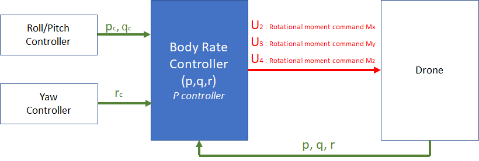

 

##### "Roll Pitch" controller :
The "Roll Pitch" controller calculate the desired pitch angle (P command : pc) and roll angle (Q command :qc).

He takes as input :
	- a thrust command (from the altitude controller),
	- the desired X and Y accelerations (from the lateral controller),
	- the attitude pitch, roll, yaw and p,q,r.

and delivers as output :
	-  a target roll rate(P command : pc)an a target pitch rate (Q command : qc)

A P Controller will be implemented for this functionality.

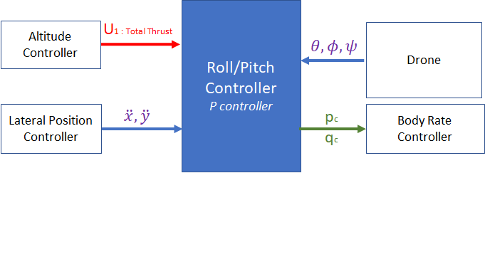

 

##### "Yaw" Controller (implemented at the end of the SW pipeline)
The "Yaw controller" controlled through the reactive moment command and that command only affects yaw. Yaw is treated in isolation. 

He delivers the target Yaw rate (R command : rc).

He is a part of the "Attitude Controller" but he is located at the end of the SW pipeline.

A P Controller will be implemented for this functionality.

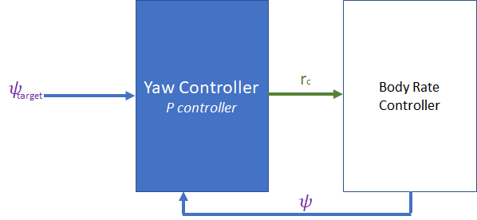

 

#### Part 2 : Altitude Controller
2-) "Altitude" controller :
The "Altitude controller" is responsible for ensuring the vehicle stays close to the commanded set position and velocity by computing a target thrust value.

A PID Controller will be implemented for this functionality.

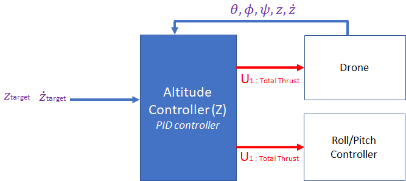

 

#### Part 3 : Lateral Position Controller
3-) "Lateral Position" controller :
The "Lateral position" controller is responsible for ensuring the drone stays close to the the X and Y trajectories.

He generates an acceleration command in the x and y directions, which is sent to the roll/pitch controller.

A PD Controller will be implemented for this functionality.

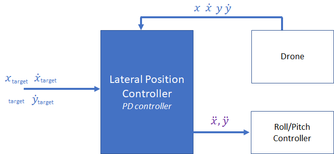

 

#### Note about the sequence of implementation for the controllers
The target is to implement and tune the inner control loops first, because the inner loop operate on a faster scale that the outer loops.

The outer loop runs with a 10/100 Hz update rate, and every time it gets called, it provides a command to the inner faster loop controller, which is running with a 100/1000 Hertz update rate.

These frequency depends of the sensors, that provide the information to close the loop (for example : GPS outdoors or vision indoors : update rate : 1->10 Hz,IMU for angle rate data : update rate : 100/1000 Hz). 

-----------------------
### Mathematics

The target is to give her the most important mathematics equations to resolve this project.

All the mathematic equations demonstration are developed in these two papers :

http://www.dynsyslab.org/wp-content/papercite-data/pdf/schoellig-acc12.pdf

http://flyingmachinearena.org/wp-content/publications/2011/schoellig_feasibility_of_motion_primitives.pdf

Only the equations of the most mathematically controller (Roll/Pitch Controller) are here described.

The other controllers are more trivial and the equations can be found in the two research papers.

#### Rotation Matrix definition
The rotation matrix  assures the transformation Body Frame Acceleration/ World Frame Acceleration

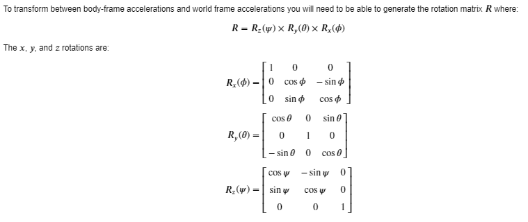

 

#### Roll/Pitch Controller Equations 
With the help of these equations, we can find the pc and the pc 

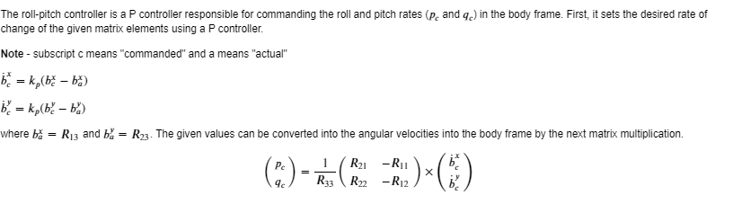

 

#### Roll/Pitch Controller Code
To make a better analogy between the equations and the code :

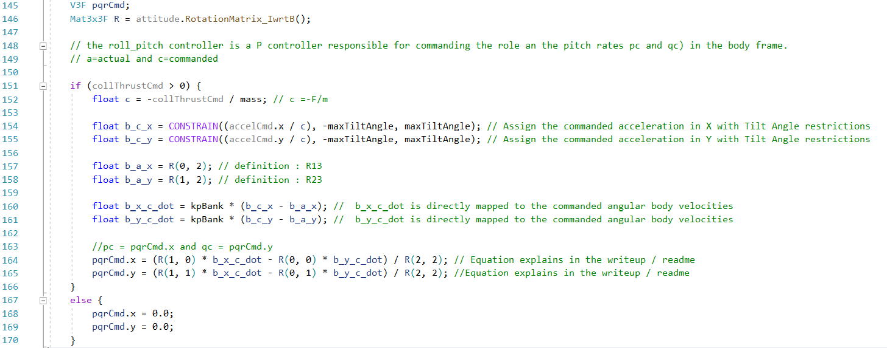

-----------------------
### Hyperparameters Tuning
The method used for this project was the 'manual Tuning" in the file "QuadCOntrolParams.txt". THE others method "TWIDDLE" haven't used.

Example : Position control gains kpPosZ et KiPosZ 

The P gain is used to minimize the tracking error. 

He has been increase very slowly until to see an acceptable result with a drone reaction acceptable and not a lot of oscillation ( step by step : 1, 10, 20 until 45)

The D gain was not configurable, in reality he must delete the oscillation.

The I Gain must control the sum of the error, which cause systematic error. He has been tuned after a couple of cycle time to delete the offset between the desires and the actual rate over a longer time. 

The I Gain has been increase very slowly until to delete a drift back.

------------------------
### Tests scenarios

#### Scenario 2 : Attitude Control
##### Performance metrics
- Roll should less than 0.025 radian of nominal for 0.75 seconds (3/4 of the duration of the loop)
- roll rate should less than 2.5 radian/sec for 0.75 seconds
##### Results
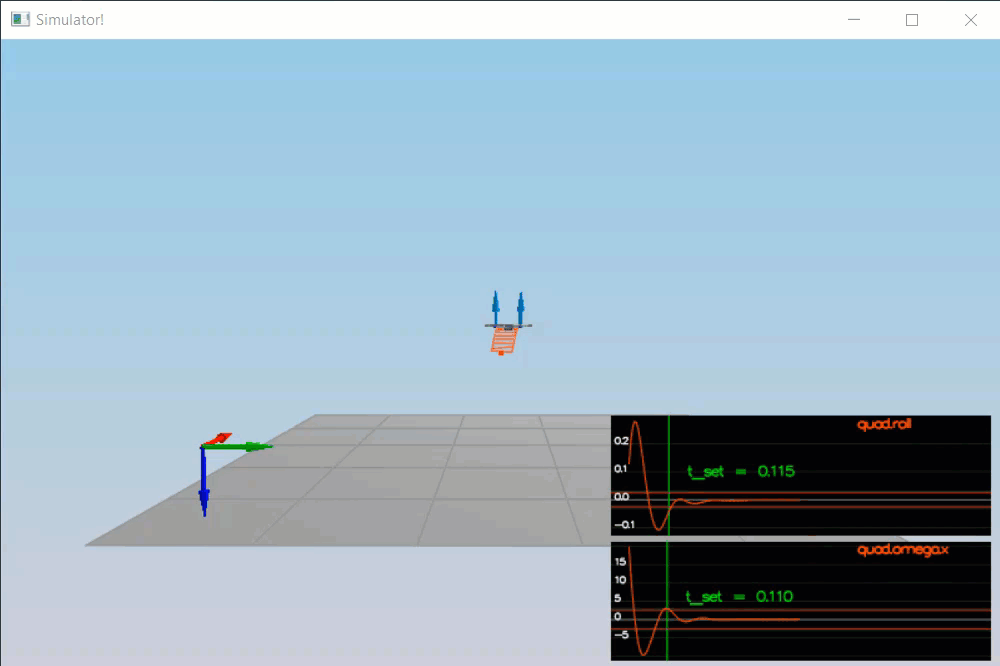

#### Scenario 3 : Position Control
##### Performance metrics
- X position of both drones should be within 0.1 meters of the target for at least 1.25 seconds
- Quad2 yaw should be within 0.1 of the target for at least 1 second
##### Results
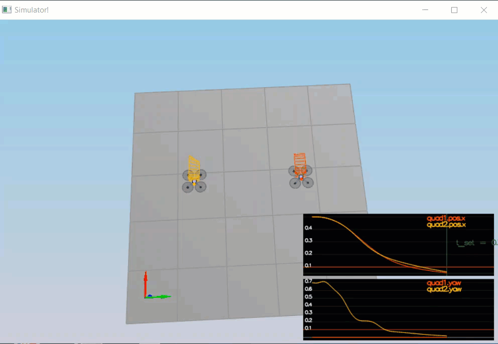

#### Scenario 4 : Nonidealities
##### Performance metrics
- Position error for all 3 quads should be less than 0.1 meters for at least 1.5 seconds
##### Results
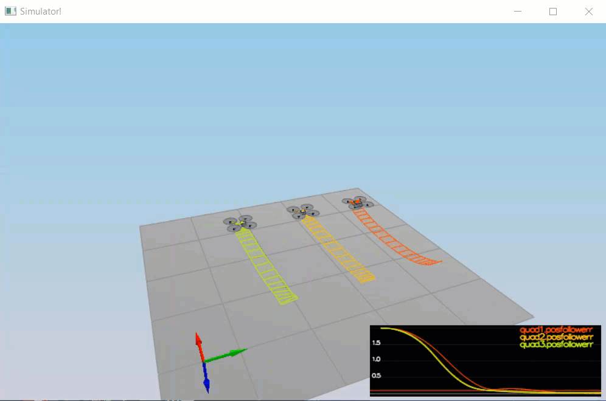

#### Scenario 5 : Trajectory Follow
#### Performance metrics
- Position error of the quad should be less than 0.25 meters for at least 3 seconds
##### Results

-------------------------
### Installation

THe tools are :

 - [Development environment setup](#development-environment-setup)
 - [Simulator walkthrough](#simulator-walkthrough)
 - [The tasks](#the-tasks)
 - [Evaluation](#evaluation)

## Development Environment Setup ##

Regardless of your development platform, the first step is to download or clone this repository.

Once you have the code for the simulator, you will need to install the necessary compiler and IDE necessary for running the simulator.

Here are the setup and install instructions for each of the recommended IDEs for each different OS options:

### Windows ###

For Windows, the recommended IDE is Visual Studio.  Here are the steps required for getting the project up and running using Visual Studio.

1. Download and install [Visual Studio](https://www.visualstudio.com/vs/community/)
2. Select *Open Project / Solution* and open `<simulator>/project/Simulator.sln`
3. From the *Project* menu, select the *Retarget solution* option and select the Windows SDK that is installed on your computer (this should have been installed when installing Visual Studio or upon opening of the project).
4. Make sure platform matches the flavor of Windows you are using (x86 or x64). The platform is visible next to the green play button in the Visual Studio toolbar:

5. To compile and run the project / simulator, simply click on the green play button at the top of the screen.  When you run the simulator, you should see a single quadcopter, falling down.

### Linux ###

For Linux, the recommended IDE is QtCreator.

1. Download and install QtCreator.
2. Open the `.pro` file from the `<simulator>/project` directory.
3. Compile and run the project (using the tab `Build` select the `qmake` option.  You should see a single quadcopter, falling down.

**NOTE:** You may need to install the GLUT libs using `sudo apt-get install freeglut3-dev`

## Simulator Walkthrough ##

Now that you have all the code on your computer and the simulator running, let's walk through some of the elements of the code and the simulator itself.

### The Code ###

For the project, the majority of your code will be written in `src/QuadControl.cpp`.  This file contains all of the code for the controller that you will be developing.

All the configuration files for your controller and the vehicle are in the `config` directory.  For example, for all your control gains and other desired tuning parameters, there is a config file called `QuadControlParams.txt` set up for you.  An import note is that while the simulator is running, you can edit this file in real time and see the affects your changes have on the quad!

The syntax of the config files is as follows:

 - `[Quad]` begins a parameter namespace.  Any variable written afterwards becomes `Quad.<variablename>` in the source code.
 - If not in a namespace, you can also write `Quad.<variablename>` directly.
 - `[Quad1 : Quad]` means that the `Quad1` namespace is created with a copy of all the variables of `Quad`.  You can then overwrite those variables by specifying new values (e.g. `Quad1.Mass` to override the copied `Quad.Mass`).  This is convenient for having default values.

You will also be using the simulator to fly some difference trajectories to test out the performance of your C++ implementation of your controller. These trajectories, along with supporting code, are found in the `traj` directory of the repo.

### The Simulator ###

In the simulator window itself, you can right click the window to select between a set of different scenarios that are designed to test the different parts of your controller.

The simulation (including visualization) is implemented in a single thread.  This is so that you can safely breakpoint code at any point and debug, without affecting any part of the simulation.

Due to deterministic timing and careful control over how the pseudo-random number generators are initialized and used, the simulation should be exactly repeatable. This means that any simulation with the same configuration should be exactly identical when run repeatedly or on different machines.

Vehicles are created and graphs are reset whenever a scenario is loaded. When a scenario is reset (due to an end condition such as time or user pressing the ‘R’ key), the config files are all re-read and state of the simulation/vehicles/graphs is reset -- however the number/name of vehicles and displayed graphs are left untouched.

When the simulation is running, you can use the arrow keys on your keyboard to impact forces on your drone to see how your controller reacts to outside forces being applied.

#### Keyboard / Mouse Controls ####

There are a handful of keyboard / mouse commands to help with the simulator itself, including applying external forces on your drone to see how your controllers reacts!

 - Left drag - rotate
 - X + left drag - pan
 - Z + left drag - zoom
 - arrow keys - apply external force
 - C - clear all graphs
 - R - reset simulation
 - Space - pause simulation

